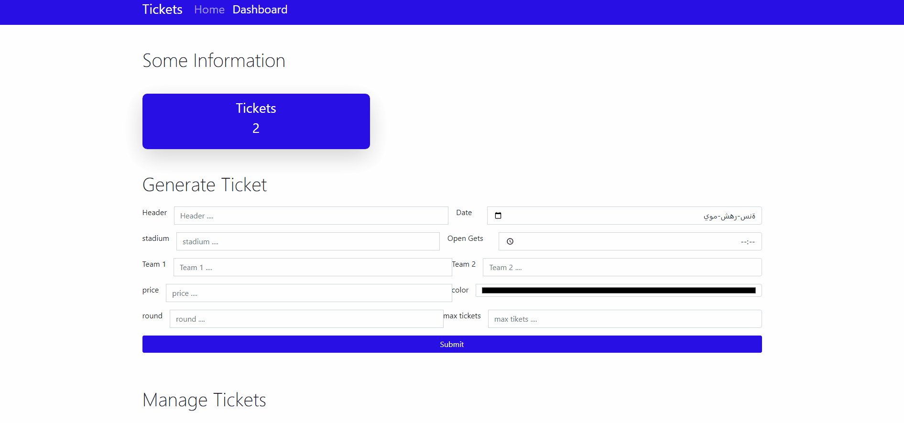

# RESTful API ***Tickets***  With Ui (Full) 🔥
## By Ultrasdzcoder
### You can see Full Course ***[here](https://www.youtube.com/c/UltrasDzCoder?sub_confirmation=1)***

---

 
 

## We Use 💪 :
- ✅ Node.
- ✅ Express.
- ✅ MongoDB.
- ✅ Postman.
- ✅ HTML.
- ✅ CSS.
- ✅ JAVASCRIPT.
- ✅ BOOTSRAP.
- ✅ FONTAWESOME.

 
 
 

---
### Install & Run ✨ :
 

      npm install 

 

---

 

### Another Dependencies & Packages Project ⭐:

 

      npm i express mongoos dotenv
      npm i -D nodemon
      npm i boostrap
      npm i font-awesome
      npm i html2pdf

### Don't Forget .env File ⭐:

 

      NODE_ENV = devlopment
      PORT = <port>
      MONGO_URI = <database-url/namedatabase>